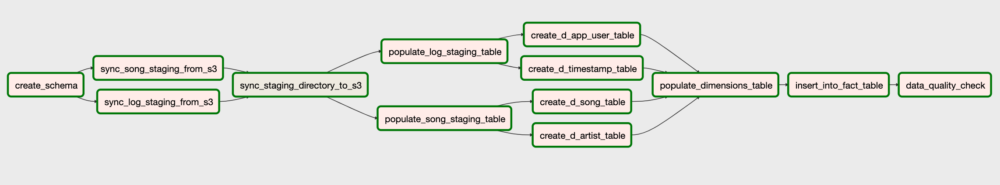
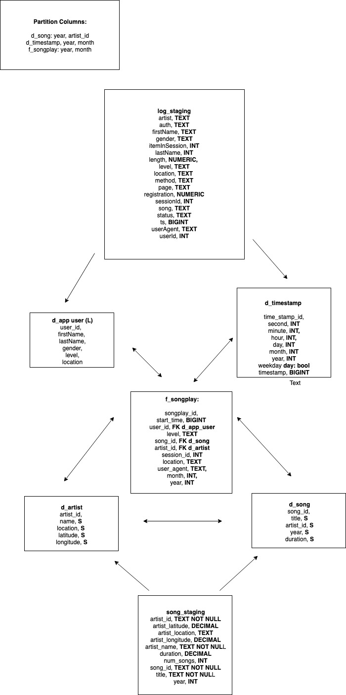

# SPARKIFY AIRFLOW

## Airflow Pipeline To Fetch JSON Files from s3 and transform them into a series of queriable tables in AWS Redshift

### Project Overview

Music company sparkify generate JSON logs that cover how songs are played in their app. This dataset is joined with an open source songs and artist JSON collection so data analysts can identify trends in song plays. Apache airflow is used as the orchestration tool for the pipeline.

### App Architecture

### Database Schema 

### Setup

* Clone the repo 
* From a python3 virtualenv install airflow and pandas
* In your bashrc/zshrc set AIRFLOW_HOME to the directory of the cloned repo 
* Start airflow via initializing the airflow db, then the webserver
* The graph view should show the same DAG as the app architecture
* Add redshift connections to the connections section of the webserver
* Add the repo directory path to airflow variables under PROJECT_PATH
* Add your s3 to redshift IAM_ROLE to airflow variables under IAM_ROLE
* Start the airflow schdeuler 
* The DAG will execute

### Additional Steps

* Setup parralel executor so non-dependent tasks (sync_song/log_staging) can be triggered
* Setup master/slave architecture/cluster with airflow on master and triggering tasks on slaves for performance benefits
* Develop unit tests to make code more production ready and increase documentation
* Review schema optimization and how indexes could be best used to increase performance 
